# Freedom

# FREEDOM
**3lb Vertical Spinner Combat Robot**
 
**Villanova Combat Robotics | National Havoc Robotics League (NHRL)**
 
**Role: Frame and Armor Lead**

<!-- HERO IMAGE: final photo of the bot, or CAD render if photo isn't available -->

## Overview

FREEDOM is a 3lb vertical spinner combat robot built for the National Havoc Robotics League (NHRL), one of the largest competitive combat robotics circuits in the country. FREEDOM was part of the first cohort of robots Villanova Combat Robotics ever brought to competition, and the club's first appearance at NHRL.

As The Frame and Armor Design Lead, I focused on the frame and supporting joint system: selecting parts, designing and iterating the CAD in SolidWorks, machining the components on a lathe and mill, and integrating the electronics (soldering, motor controller tuning, and receiver configuration) needed to get the system running reliably in competition. Beyond the weapon system, I also supported the build more broadly. I collaborated with teammates on integration across subsystems, weighed in on part selection for the platform, contributed to chassis design, and tracked the robot's weight against the 3lb limit using a shared weight budget spreadsheet. I also assisted with machining and electronics work outside my own scope. As this was Villanova Combat Robotics' first competition build, most of the process was worked out as a team in real time. That meant frequent coordination on design tradeoffs and build priorities across the group.

## Bill of Materials
| Component | Function | Part | Photo |
|---|---|---|---|
| Weapon Motor | Drives the weapon system | BadAss 2315-1480Kv Brushless Motor | 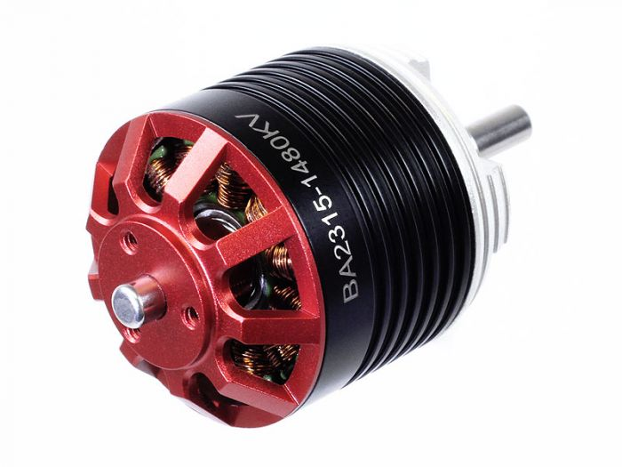 |
| Drive Motor | Powers wheel drivetrain | Max Brushless 2006 Mk2 Beetleweight Planetary Gearmotor | 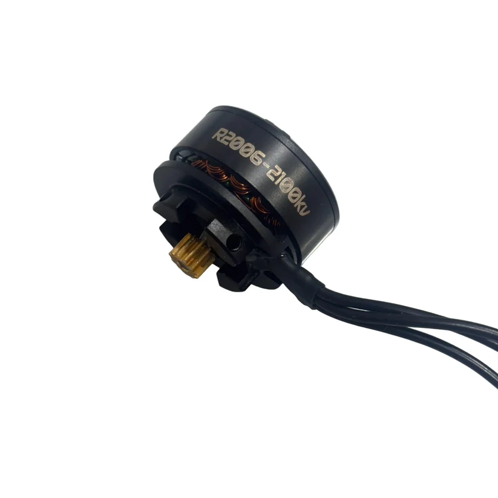 |
| Weapon ESC | Controls weapon motor speed | Vortex 80A ESC (Beetle Weapon / Big Bot Drive) | 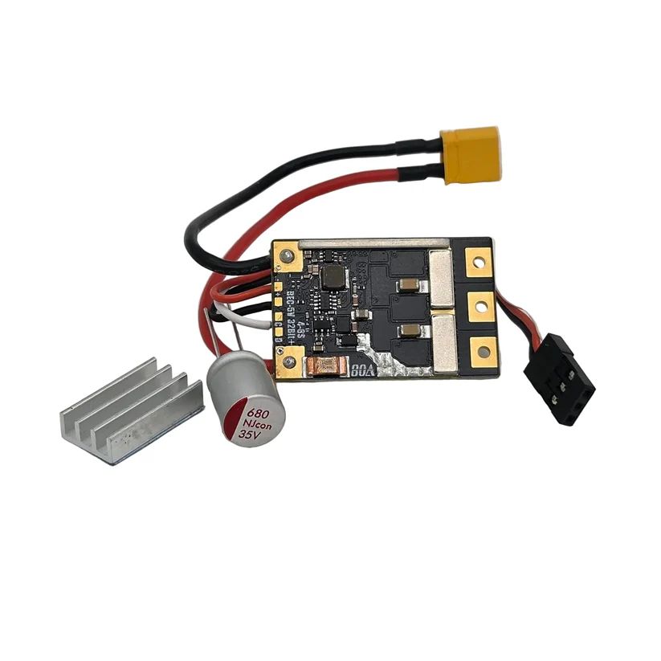 |
| Weapon Metal | Raw stock for weapon fabrication | 2" Alloy Steel Round Bar, 4140 Annealed, Cold Finish | 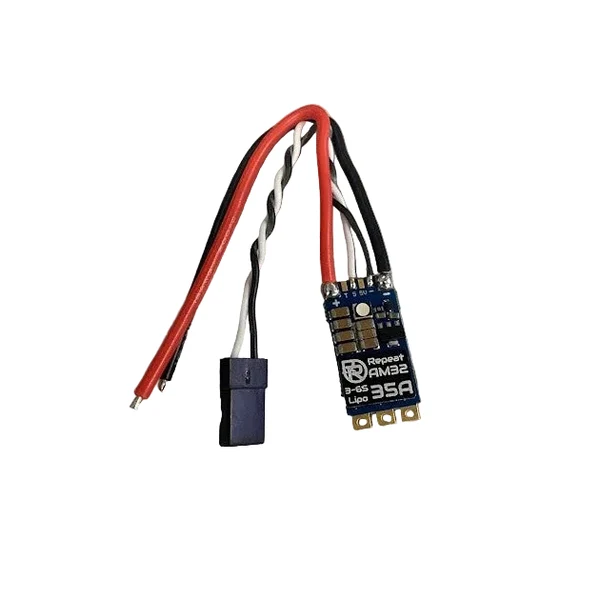 |
| Dead Shaft Metal | Raw stock for dead shaft fabrication | 1/2" Alloy Steel Round Bar, 4140 Annealed, Cold Finish | 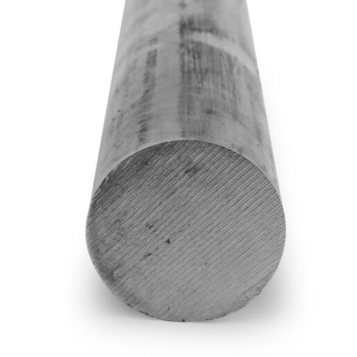 |
| Chassis Material | Lightweight structural plate for chassis | Carbon Fiber Plate | 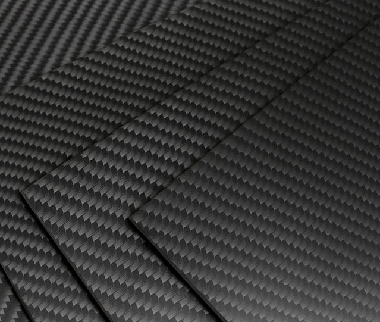 |
| Ball Bearings | Support rotating shafts | TRITAN Radial Ball Bearing 6000, Dbl Sealed, 10 mm Bore, 26 mm OD, 8 mm Wd | 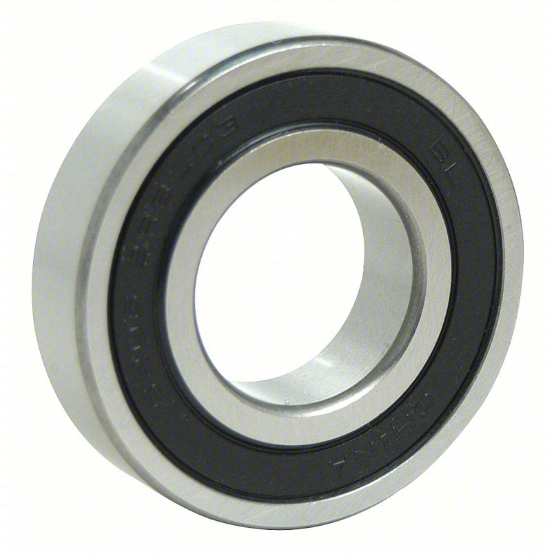 |
| Timing Belt Pulley | Transfers rotational drive to belt | High-Strength GT Timing Belt Pulley, Press-Fit, 9 mm Max Belt Width, 3/16" Shaft, 16T | 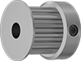 |
| Timing Belt | Transmits drive motor power | High-Strength Ultra-Quiet Timing Belt, Curved Teeth, 9 mm, 165-3P-09, Gates PowerGrip GT | 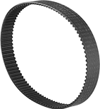 |
| Wheels | Provide traction/mobility | BaneBots Wheel, 2" x 0.8", Hub Mount, 50A, Blue | 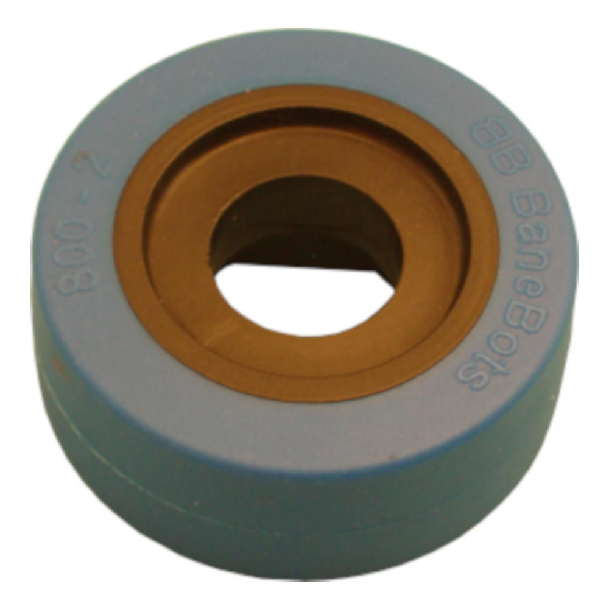 |
| Wheel Hubs | Mount wheels to drive shaft | T81 Hub, 6 mm Shaft | 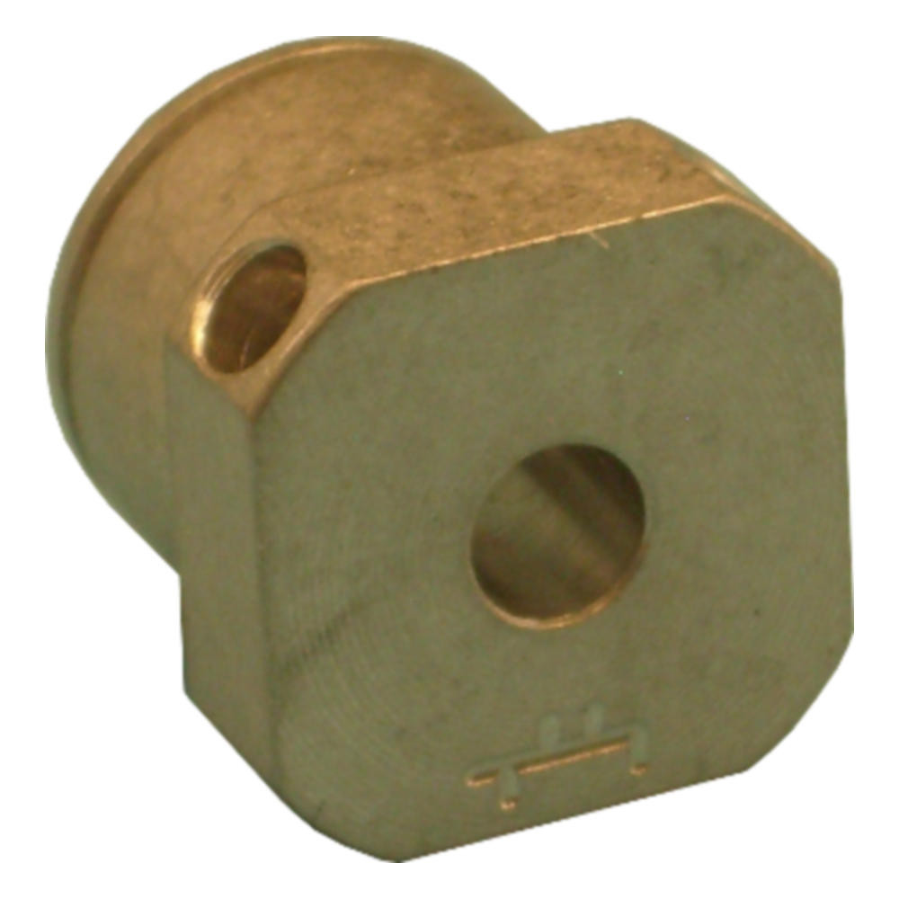 |
| Transmitter | Sends control inputs to robot | FlySky FS-i6 6CH Transmitter | 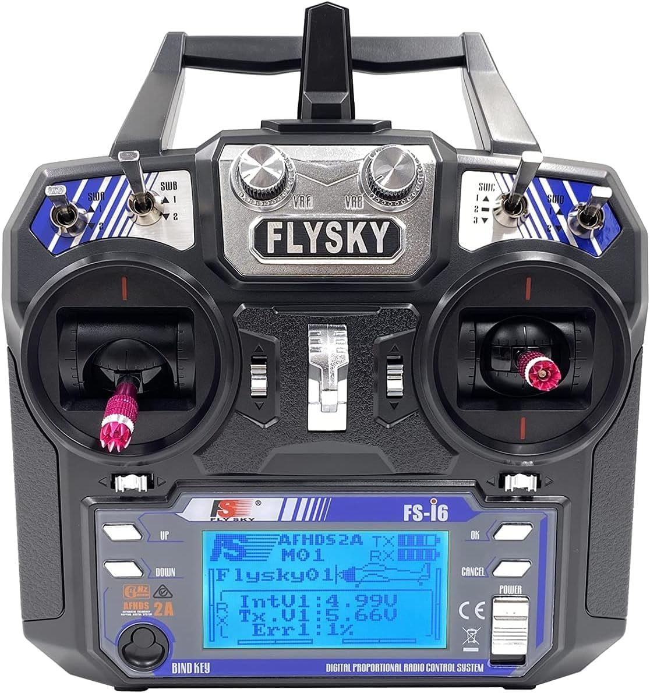 |
| Receiver | Receives transmitter signal, outputs to ESCs | FlySky FS-iA6B 6CH Receiver |  |

## Design & CAD
The frame system went through multiple design iterations in SolidWorks before being finalized for machining. As Frame Systems Design Lead, this design work, and the machining that followed, was my primary responsibility on the team. Design iterations were mainly focused on maneuverability, deflecting oponents weapons, handling weapon vibration, and weight. Throughout this process, I worked closely with the weapons team to make sure the weapon would mount correctly, function as intended within the chassis geometry, and stay within the robot's overall weight budget.

### Weapon

*CAD design of the vertical spinner and dead shaft assembly. The weapon uses ball bearings and 3D-printed spacers mounted on the dead shaft, allowing the spinner to be belt-driven while the shaft itself remains stationary. The dead shaft mounts to aluminum side walls, shown below in the Chassis design. Simple FEA was performed to confirm the dead shaft and weapon could withstand impact loading from opposing robots.*

### Chassis
<!-- CHASSIS CAD -->
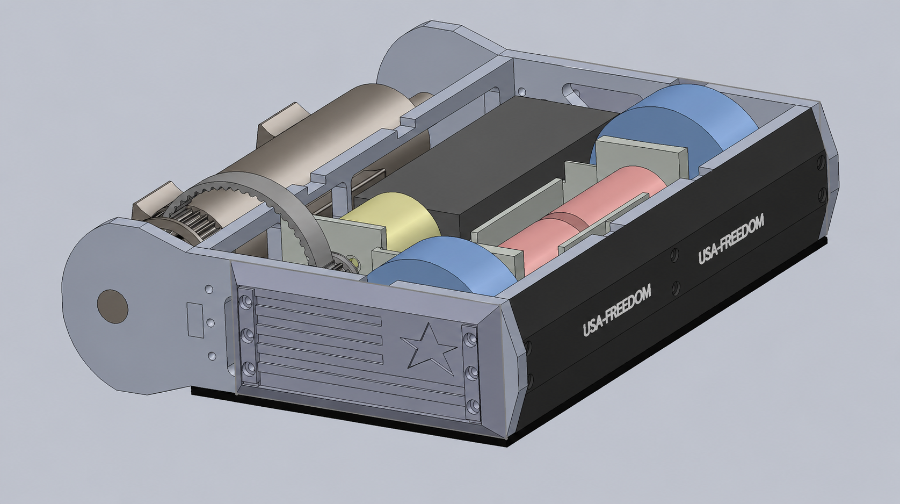
<!-- WEAPON CAD -->
<!--  -->

*Chassis CAD, built around a low-profile carbon fiber plate to minimize weight while protecting the drivetrain and electronics.*

## Fabrication

<!-- PLA PROTOTYPE -->
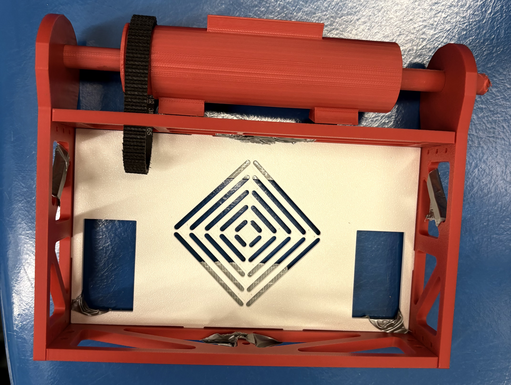

*Once the design was validated in PLA, the final weapon system components were machined from 4140 alloy steel on a lathe and mill, including turning the dead shaft and milling the weapon hub to final tolerance.*

## Electronics

Electronics was another main area where I worked closely with the chassis team, drawing on prior experience with RC controllers to help the group get the system running reliably. Electrical integration covered the full signal and power chain: soldering motor and battery connections, tuning the weapon and drive ESCs for consistent throttle response, configuring the receiver (mapping controller inputs to the correct channel outputs), and adjusting the throttle curve to fine-tune drive responsiveness for competition conditions.

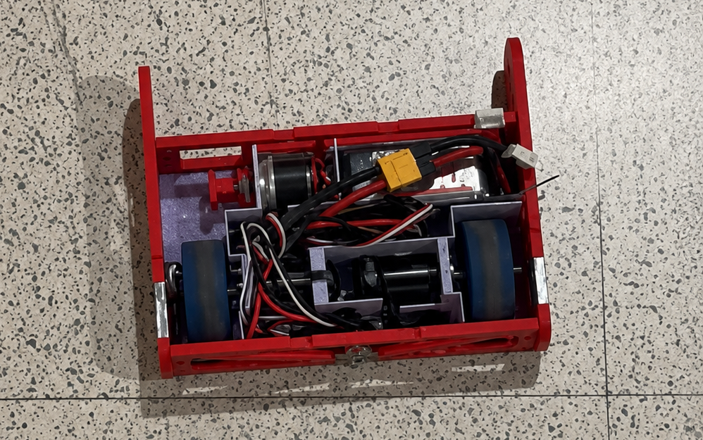

*PLA prototype with electronics installed for driving test.*

*FlySky transmitter subtrim configuration, used to fine-tune channel centering and drive responsiveness ahead of competition.*

## Testing & Demo

<!-- DRIVING DEMO VIDEO -->
<video src="https://github.com/user-attachments/assets/a1d59dde-191d-4497-a97f-fc3ec471614c" controls width="200"></video>

*FREEDOM's drivetrain under remote control. The weapon system isn't shown here, as no safe testing environment was available prior to competition.*

## Status

FREEDOM competed at NHRL as part of Villanova Combat Robotics' first-ever competition cohort. The night before competition, the CNC machine's chuck shattered with no replacement available, forcing the team to manually machine key weapon features under significant time pressure. This left no window to test the weapon system before competition, and the resulting parts had tolerance and balance error that the manual process couldn't fully control. Under competition RPM, this caused the weapon to vibrate loose mid-match, and the bot was eliminated quickly as a result. The weapon system, from CAD through machining and electrical integration, was designed, built, and fielded as a complete, competition-ready system, and this experience directly shaped both the lessons below and my priorities heading into this year's build.

## Lessons Learned

- **Build in schedule margin.** With no buffer before competition, a single equipment failure eliminated the ability to test before fielding the robot. Future builds need machining and assembly finished with enough lead time to survive a setback like this.
- **Don't rely on a single point of failure for critical fabrication.** The CNC being unavailable with no backup plan (alternate machine, outside shop, or manual-machining-friendly design as a fallback) turned one broken part into a cascading failure.
- **Weapon length likely drove much of the difficulty.** The weapon's length accounted for a large share of the robot's total weight, which tightened the margin everywhere else in the design and likely contributed to the tolerance and balance issues under manual machining.

## Future Work

This year, I'm stepping into a broader leadership role as co-lead for the entire robot, directing mechanical design and build scheduling across all subsystems, while continuing to lead weapon system development directly. I'm also developing a training curriculum for new members covering soldering, SolidWorks/CAD, embedded systems, machine shop fabrication (lathe, mill, CNC), and FEA, to build technical capacity across the growing team. Planned changes for the next build include:

- **Shortening the weapon** to reduce weight, moment of inertia, and stress on the mount, easing both machining tolerances and structural demands
- **Redesigning the weapon shape** to be more robust to imprecision from manual machining, in case CNC access is disrupted again
- **Building schedule margin and equipment contingencies into the build timeline**, so a single point of failure can't eliminate the team's ability to test before competition
